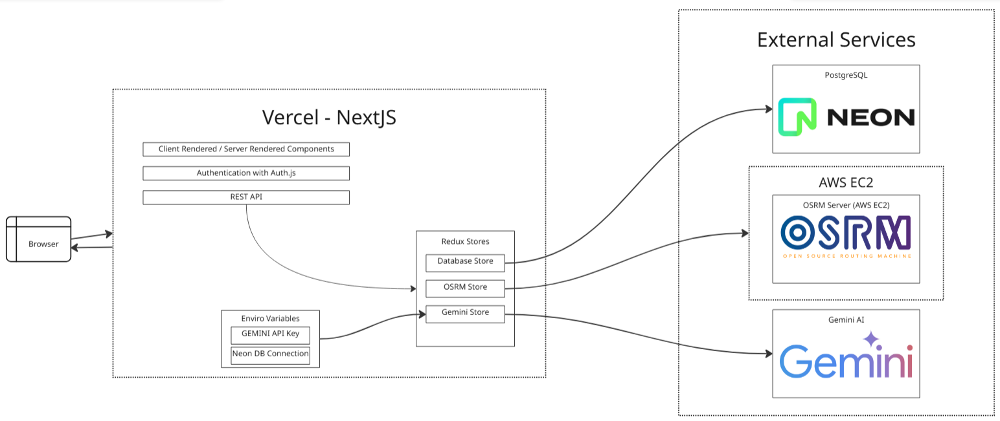

# Pedal N' Path

Pedal N’ Path is a social cycling application that integrates a responsive web design. It aims to help users explore, create, and review bicycle tracks around New Zealand. It also lets users get inspiration from Gemini AI, to explore popular tracks.

## Quick Start

Open [Pedal N' Path](https://pedalnpath-nextjs-app.vercel.app/home) on your browser. Pedal N' Path works on a number of screens, such as phone, laptop or computer.

First, create an account. Then, you can access the different parts of the website.

## Key Features

- **Explore bike paths** on the homepage. You can filter paths by difficulty or distance. You can also save paths to your profile.
- **Explore with Gemini** to find inspiration for paths around a specific location. You can check out the route, description and add the path to your profile.
- **Check out community reviews** for inspiration on tracks around NZ.
- **Create new bike paths**. After choosing a start and end point, you can add descriptions, notes and track details to the new path.
- **View your saved tracks** on your dashboard. You can also mark paths as complete or to be done.
- **Write, edit and delete reviews** for any bike path.

## Architecture Overview


### Next.js and Vercel

The Pedal N' Path web application is built with Next.js. Using this full-stack framework allows it to combine a highly interactice UI with API routes that seamlessly integrate with the backend database client.

This web application is deployed onto Vercel. Any changes to the main branch of this repository will automatically redeploy the application.

### PostgreSQL, Neon

There are 4 main tables stored in the PostgreSQL database:

- Users
- Bikepaths
- UserPaths
- Reviews

Running with PostgreSQL, allows for easier relational database functions with specific data types enforced.

### Prisma ORM

The Nextjs application interacts with this external severless database through Prisma ORM. It enables quick and efficient database queries and schema migrations.

### OSRM Backend Server

The Open Street Routing Machine for PNP has been designed to process route calculations around NZ. It runs via an AWS EC2 Instance to receive API requests and dynamically generate driving, cycling or walking routes. It uses OpenStreetMap data to compute optimised routes, and [more information can be viewed here](https://project-osrm.org/docs/v5.5.1/api/#general-options).

### Gemini AI

Pedal N Path's innovative use of AI involves sending requests to [Gemini](https://www.google.com/aclk?sa=L&ai=DChsSEwjy_tGV2ZqQAxXfHoMDHYLYEnQYACICCAEQABoCc2Y&ae=2&co=1&ase=2&gclid=Cj0KCQjw3aLHBhDTARIsAIRij59a9RaQV_slnzFndeG34RLBF26oDVqrXaHu8307EnYNDNnrBiI5JjoaAiV3EALw_wcB&cid=CAASNuRoNzYRJGkFCAjwOMTEvYH3rdfZQvmpMsjsPx3pDFYvFYMbLiVAho61eLEtlOCDFi4tUjFlJw&cce=2&category=acrcp_v1_71&sig=AOD64_2bzEED-04nT34aDTmunTcb0HfQ3w&q&nis=4&adurl&ved=2ahUKEwia3cyV2ZqQAxUrzjgGHXXHHU4Q0Qx6BAgMEAE).

When a user asks for bike paths around a region, Pedal N' Path processes and sends these requests to Gemini. The response received is parsed to ensure a valid JSON format.

```bash
# Responses are displayed in JSON format
[{
    title: "",
    description: "",
    difficulty: "",
    distanceKm: number,
    duration: "",
    startCoordinate: [0, 0],
    endCoordinate: [0, 0],
    coordinates: [ [0, 0], [0, 0], [0, 0]]
    highlights: ["", "", ""],
    notes: "",
    trackType: "",
    suitableFor: ["", "", ""],
}]
```

# Setup Locally
In order to set this project up locally, you need to pull the Docker Image from dockerhub:
[jwangr/pedalnpath-nextjs-app:latest](https://hub.docker.com/layers/jwangr/pedalnpath-nextjs-app/latest/images/sha256:44f7b4c4dbee90f8fec03c114ffcc6d45cd41a17b213e06449dbc42f05f0e8ba?uuid=192CA71C-BB86-4ED0-BA69-BBFEE343635E)


From there, you need acces to .env keys, including
- Gemini_API
- Database_URL
- OSRM_URL

# Future Scope
- Shift to comprehensive external ORM database for geospatial data: e.g. PostGIS (extension of PostgreSQL)
- Integrating Redis: to lower latency, database load and improve response time
- Additional Features
    - Create elevation profiles through external services that use OSRM geometries (coordinates)
    - Users can upload pictures along with a review
    - Providing specific legs of a journey
    - Changing map tiles. Currently default road view: consider satellite or terrain view
    - Performance tracking: heart rate, duration, performance analysis

